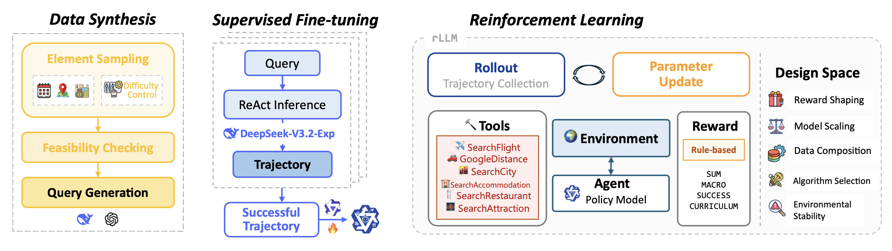
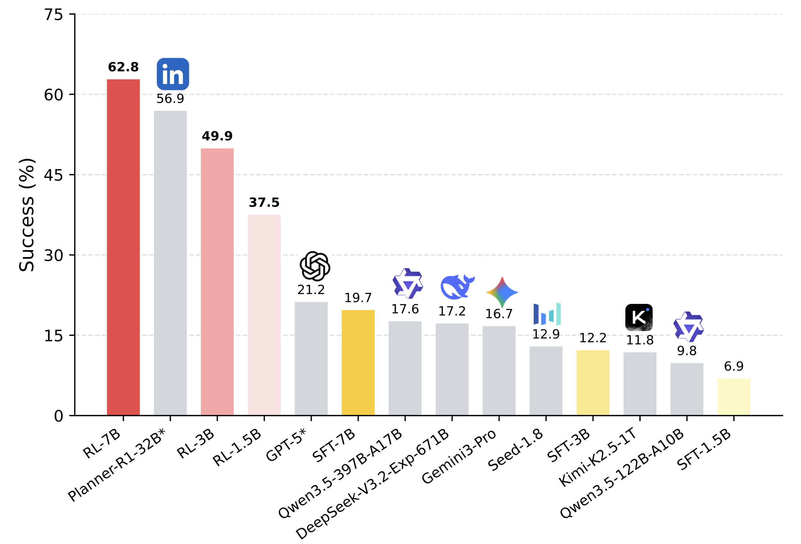

# AgentSTAR 

<p align="center">
   <a href="https://arxiv.org/abs/XXXX.XXXXX"></a>
   <a href="https://huggingface.co/datasets/xxwu/Agent-STAR-TravelDataset"></a>
   <a href="https://huggingface.co/collections/xxwu/agent-star"></a>
</p>


This repository is the official implementation of our paper: **Demystifying Reinforcement Learning for Long-Horizon Tool-Using Agents: A Comprehensive Recipe**.

We use [TravelPlanner](https://github.com/OSU-NLP-Group/TravelPlanner/) as a long-horizon tool-use testbed, where agents must iteratively call tools to satisfy multifaceted constraints, i.e., commonsense and hard constraints. We implement **STAR [Data Synthesis → SFT → RL]**, a unified post-training pipeline that systematically studies the agentic RL design space across five axes: reward shaping, model scaling, data composition, algorithm selection, and environmental stability.

> Please consider citing or giving a 🌟 if our repository is helpful to your work! 

```
@misc{wu2026agentstar,
   title={Demystifying Reinforcement Learning for Long-Horizon Tool-Using Agents: A Comprehensive Recipe},
   author={Xixi Wu and Qianguo Sun and Ruiyang Zhang and Chao Song and Yiyan Qi and Hong Cheng}, 
   url={https://github.com/WxxShirley/Agent-STAR},
}
```





### 🎙️ News 

🌱 **[2026-03-23]** We release the data synthesis and inference framework of our STAR-pipeline, along with three STAR-SFT models and three STAR-RL models. 

--- 

## 📖 Table of Contents 

- [📚 Dataset](#-dataset)
- [🔧 Environment](#-environment)
- [🤗 Model](#-model)
- [🚀 Run Inference](#-run)
- [📮 Contact](#-contact)
- [🙏 Acknowledgements](#-acknowledgements)


## 📚 Dataset 

We open-source our data synthesis codes and **17K+** synthetic queries.

Synthetic datasets are available at https://huggingface.co/datasets/xxwu/Agent-STAR-TravelDataset:

|Data|Description|
|---|---|
|`TravelPlanner_Val180.jsonl`|Official TravelPlanner validation set of 180 instances|
|`TravelTotal_17K.jsonl`|All **17K** synthetic queries after element sampling, feasibility checking, and back-translation|
|`Travel_Mixed_1K_RL.jsonl`|Default **1K** RL training set with **mixed difficulty**|
|`Travel_{Difficulty}_1K.jsonl`|Difficulty-specific **1K** sets, i.e., Easy / Medium / Hard for controlled experiments|

To generate your own training samples, follow the three-step pipeline:

* Step 0 - Prepare the travel database
  * Download: https://huggingface.co/datasets/xxwu/Agent-STAR-TravelDatabase
  * Put all CSV files under `database/`.

* Step 1 - Element sampling
  ```
  cd DataSynthesis
  python3 step1_generate_dict.py --generate_dict --easy_num 1000 --medium_num 1000 --hard_num 1000
  ```

* Step 2 - Feasibility checking
  Merge the sampled files into a single file, e.g., `combine_3k.jsonl`, then:
  ```
  python3 step2_dict_feasibility.py --path output/combine_3k.jsonl
  ```
  Output files: `*_feasible.jsonl` and `*_failed.jsonl`.

* Step 3 - Query generation (back-translation)
  Use LLM back-translation to turn feasible JSON elements into natural language TravelPlanner queries 

  Fill API keys in `step3_generate_query.py` first:
  ```
  python3 step3_generate_query.py --input_file output/combine_3k_feasible.jsonl --output_file output/combine_3k_final.jsonl
  ```


## 🔧 Environment

For inference, the required packages are:

```
vllm==0.11.0
transformers==4.57.3
torch==2.8.0
```

Before running the inference, you have to download the [travel database](https://huggingface.co/datasets/xxwu/Agent-STAR-TravelDatabase), and put all the CSV files under the `database` folder.

If you use commercial LLMs like Gemini3-Pro, Seed-1.8 / Seed-2.0, Kimi-K2.5, DeepSeek-V3.2, Qwen3-Plus (Qwen3-397B-A17B), etc, fill up the corresponding API keys in `Inference/config.json`.


## 🤗 Model

We release both the **STAR-SFT** and **STAR-RL** tuned models across **1.5B / 3B / 7B** scales for reproducing and further research.

Backbones: **Qwen2.5-Instruct**.

SFT: fine-tune from the Qwen2.5-Instruct base using **1K successful trajectories**, which are generated by **DeepSeek-V3.2-Exp-Thinking** on synthetic queries.

Training details: the corresponding SFT scripts are provided under `SFTScripts/`. The scripts are based on **LLaMAFactory 0.9.4.dev0**.

|Model|Path|
|-----|-----|
|Agent-STAR-SFT-1.5B|https://huggingface.co/xxwu/Agent-STAR-SFT-1.5B|
|Agent-STAR-SFT-3B|https://huggingface.co/xxwu/Agent-STAR-SFT-3B|
|Agent-STAR-SFT-7B|https://huggingface.co/xxwu/Agent-STAR-SFT-7B|


For STAR-RL, we follow the paper’s scale-aware recipe: smaller models benefit from curriculum-style rewards and exploration-heavy algorithms, e.g., ARPO, while 7B can leverage GRPO with the dense SUM reward for stronger performance and faster convergence.

|Model|Path|
|-----|-----|
|Agent-STAR-RL-1.5B|https://huggingface.co/xxwu/Agent-STAR-RL-1.5B|
|Agent-STAR-RL-3B|https://huggingface.co/xxwu/Agent-STAR-RL-3B|
|Agent-STAR-RL-7B|https://huggingface.co/xxwu/Agent-STAR-RL-7B|




The figure summarizes TravelPlanner test-set success across training variants and model scales.

## 🚀 Run Inference

The inference code lives under `Inference/`. The pipeline is:
**ReAct inference** → **post-processing [NL → structured JSON]** → **evaluation [Commonsense + Hard constraints]**.

### Quick scripts
We provide ready-to-use scripts under `Inference/scripts/`:
* `infer_sotamodel.sh`: run inference with strong commercial LLMs 
* `infer_testset.sh`: deploy a local model using vLLM and run inference on the TravelPlanner test set

### Step-by-step

* Step 0: Prepare the environment
  * Put the TravelPlanner travel [CSVs](https://huggingface.co/datasets/xxwu/Agent-STAR-TravelDatabase) under `database/`.
  * If you use commercial LLMs, fill `Inference/config.json` including API endpoints and keys.

* Step 1: Run ReAct inference 
  From the repo root, you can run:
  ```
  cd Inference
  python3 -u main.py \
    --model YOUR_MODEL_PATH_OR_NAME \
    --save_suffix YOUR_SUFFIX \
    --max_workers 20 \
    --split validation  # or test
    --max_context 32768 \
    --max_turns 60 
  ```

  If you want to run inference on your own synthesized dataset, add:
  `--use_custom_query --input_file YOUR_FILE.jsonl`.

* Step 2: Post-processing to format plans into the evaluation JSON
  ```
  python3 -u post_process.py \
    --path PREDICTIONS.jsonl \
    --split validation  # or test
    --format_model deepseek-chat
  ```
  This converts the model’s natural-language itinerary into the strict JSON format used by the evaluators.

  **Note**: for `--split test`, `post_process.py` calls `utils.py::format_planning_for_official_test()` to normalize fields, especially `transportation` into the exact form expected by the official TravelPlanner checker.

  <span style="color:red"><b>IMPORTANT [Reward-Hacking Prevention]</b> Do not skip the transportation normalization and strict transportation matching below.</span>
  <span style="color:red"> TravelPlanner’s default `transportation_match()` is substring-based and only reliably matches `taxi` / `self-driving` / `flight`; many "driving" synonyms can be missed, which may let an agent incorrectly pass transportation checks and then incorrectly receive Success. </span>

  In our setup, we enforce **stricter transportation handling**:
  * `Inference/eval_commonsense.py` uses `detect_transportation_type(text)` to map more driving-related keywords to a consistent transportation type, and then checks constraint consistency.
  * For test split compatibility, `utils.py::format_planning_for_official_test()` rewrites transportation strings (e.g., `driving/drive/car/...` → `Self-driving`, and also handles `transportation` values starting with `from...` or `Cost:...`).

* Step 3: Evaluation
  * Validation set: 
    ```
    python3 -u eval.py --path YOUR_FORMATTED.jsonl --save_score
    ```
    Our local evaluator follows the paper’s two-dimensional scoring: **Commonsense [micro/macro]** and **Hard Constraints [micro/macro]**, and defines Success as **commonsense macro==1 AND hard macro==1**. If you compute RL rewards yourself, use these same evaluators, especially the strict transportation logic, to avoid reward hacking.
  * Test set: use the official TravelPlanner leaderboard:
    https://huggingface.co/spaces/osunlp/TravelPlannerLeaderboard


# 📮 Contact

If you have any questions about usage, reproducibility, or would like to discuss, please feel free to open an issue on GitHub or contact the authors via email at xxwu@se.cuhk.edu.hk


# 🙏 Acknowledgements

We sincerely thank the authors of [TravelPlanner](https://github.com/OSU-NLP-Group/TravelPlanner). We also appreciate the open-sourced [rLLM](https://github.com/rllm-org/rllm/) framework that supports our RL training. The first author, X. Wu, would also like to thank her previous colleagues at [DeepResearch Team@Tongyi Lab](https://tongyi-agent.github.io/blog/introducing-tongyi-deep-research/) for helpful hands-on experiments in agentic RL training and valuable insights.
